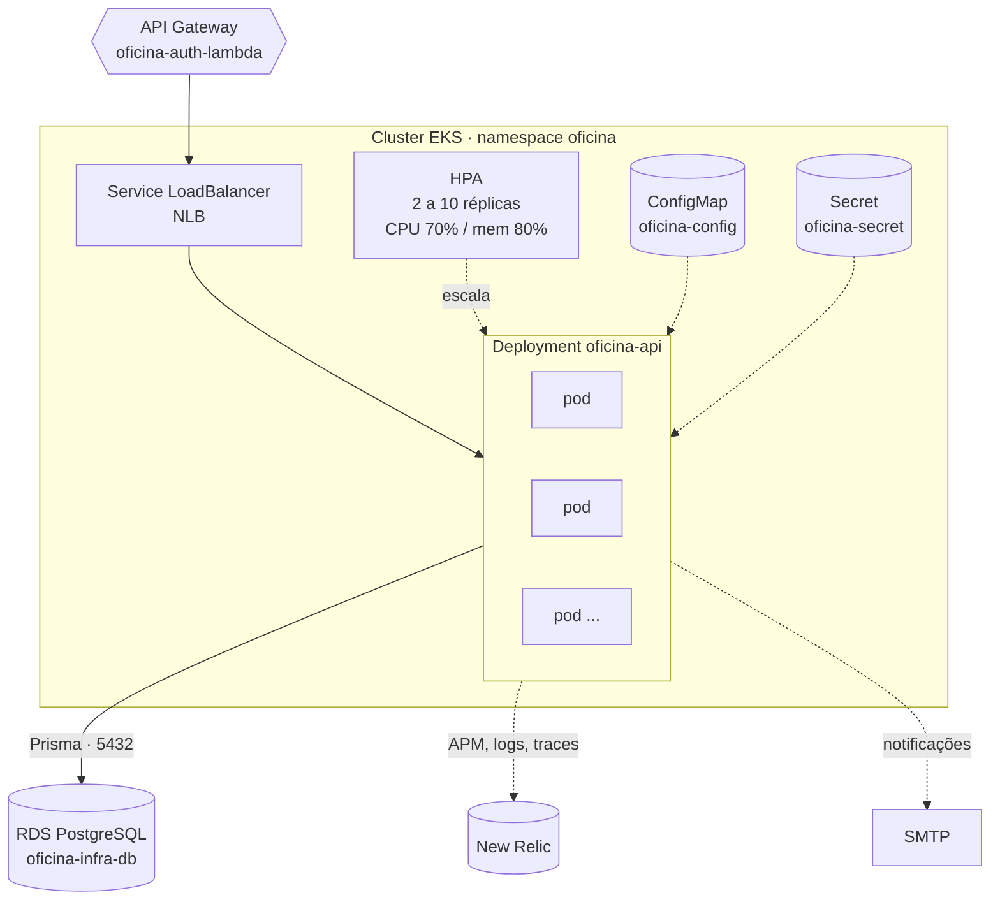

# Oficina Mecânica — API

Sistema Integrado de Atendimento e Execução de Serviços de uma oficina mecânica.
Aplicação principal executando em Kubernetes — **repositório 4 de 4** do Tech
Challenge Fase 3.

Gerencia clientes, veículos, catálogo de serviços, estoque de peças e o ciclo de
vida da ordem de serviço: Recebida → Em Diagnóstico → Aguardando Aprovação → Em
Execução → Finalizada → Entregue.

| Repositório | Papel |
| --- | --- |
| [oficina-auth-lambda](https://github.com/Xikin/oficina-auth-lambda) | Function serverless de autenticação por CPF + API Gateway |
| [oficina-infra-k8s](https://github.com/Xikin/oficina-infra-k8s) | VPC + cluster EKS + metrics-server |
| [oficina-infra-db](https://github.com/Xikin/oficina-infra-db) | RDS PostgreSQL gerenciado |
| **oficina-mvp** (este) | Aplicação principal executando no cluster |

---

## Arquitetura deste repositório



Internamente a aplicação segue Clean Architecture em quatro camadas
(`domain` → `application` → `infrastructure` / `presentation`), detalhada em
[docs/arquitetura.md](docs/arquitetura.md).

```
src/
├── domain/          contratos: repositórios, serviços, enums — sem framework
├── application/     casos de uso, um por ação
├── infrastructure/  Prisma, Nodemailer, JWT
├── presentation/    rotas Fastify, schemas Zod, middlewares de autorização
└── shared/          erros e utilitários
```

---

## Tecnologias

| Camada | Tecnologia |
| --- | --- |
| Runtime | Node.js 20, TypeScript 5.6 |
| HTTP | Fastify 4 + `fastify-type-provider-zod` |
| Banco | PostgreSQL 16 (Amazon RDS) via Prisma 5 |
| Autenticação | JWT (`@fastify/jwt`), HS256 |
| Validação | Zod |
| Testes | Vitest — 137 testes, unitários e de integração |
| Container | Docker multi-stage, usuário não-root |
| Orquestração | Kubernetes (Amazon EKS) com HPA |
| Observabilidade | New Relic APM + logs JSON (pino) com correlação |
| CI/CD | GitHub Actions — testes, imagem no Amazon ECR, deploy no EKS |
| Qualidade | SonarCloud (opcional), Prettier |

---

## Autenticação e autorização

Dois emissores de token, um único validador.

| Quem | Como autentica | Onde | Papel |
| --- | --- | --- | --- |
| Funcionário / Admin | e-mail + senha | `POST /auth/login` nesta API | `FUNCIONARIO`, `ADMIN` |
| Cliente final | CPF | `POST /auth/cpf` na [Lambda](https://github.com/Xikin/oficina-auth-lambda) | `CLIENTE` |

Cada emissor tem **segredo próprio**: `JWT_SECRET` assina o login interno e nunca sai desta API; `JWT_CLIENTE_SECRET` é compartilhado apenas com a Lambda. A API exige que tokens do emissor de clientes carreguem só o papel `CLIENTE` — quem obtiver o segredo da Lambda não consegue forjar um ADMIN ([ADR-0011](docs/adr/0011-segredos-jwt-por-emissor.md)).

O login aceita 5 tentativas por e-mail e a consulta pública 10 por número de OS, a cada
15 minutos. O login leva o mesmo tempo para e-mail existente ou não, para que não se
descubra quem tem conta cronometrando a resposta ([ADR-0012](docs/adr/0012-limites-de-tentativa.md)).

O papel determina o que se pode acessar:

| Guard | Aplicado em | Regra |
| --- | --- | --- |
| `exigirInterno` | todas as rotas administrativas | `role ∈ {ADMIN, FUNCIONARIO}` |
| `exigirDonoDoRecurso` | `GET /ordens/:id`, `GET /ordens/numero/:n`, `GET /clientes/:id` | interno passa; cliente só acessa o próprio recurso |
| `exigirRole('ADMIN')` | `/auth/usuarios` | só administrador |

> Isso não é detalhe de implementação. Sem `exigirInterno`, um token de cliente
> legítimo abriria `GET /clientes` (a base inteira, com CPF de todo mundo) e
> `PUT /ordens/:id` (alterar OS de terceiros). Ver
> [ADR-0008](docs/adr/0008-autorizacao-do-papel-cliente.md).

---

## API

- **Swagger UI:** `<API_GATEWAY_URL>/docs`
- **OpenAPI versionado:** [`docs/openapi.json`](docs/openapi.json) — 27 caminhos,
  gerado no CI a cada push, então não depende de haver ambiente no ar
- **Postman:** [`postman/oficina-mvp.postman_collection.json`](postman/oficina-mvp.postman_collection.json)
  (41 endpoints) + [environment local](postman/oficina-mvp.local.postman_environment.json)

### Fluxo mínimo

```bash
BASE=<API_GATEWAY_URL>

# Cliente final — autentica por CPF (Lambda)
TOKEN=$(curl -sS -X POST "$BASE/auth/cpf" \
  -H 'content-type: application/json' \
  -d '{"cpf":"529.982.247-25"}' | jq -r .token)

# Consulta a própria OS
curl -sS "$BASE/ordens/numero/1042" -H "Authorization: Bearer $TOKEN"

# Funcionário — autentica por e-mail e senha (esta API)
TOKEN=$(curl -sS -X POST "$BASE/auth/login" \
  -H 'content-type: application/json' \
  -d '{"email":"admin@oficina.com","senha":"..."}' | jq -r .token)

curl -sS "$BASE/ordens" -H "Authorization: Bearer $TOKEN"
```

### Healthchecks

| Rota | Uso | Verifica o banco? |
| --- | --- | --- |
| `GET /health` | liveness probe | não — de propósito |
| `GET /health/ready` | readiness probe e synthetic check | sim (`SELECT 1`) |

Liveness raso e readiness profundo: se ambos tocassem o banco, uma indisponibilidade
do RDS reiniciaria todos os pods em cascata sem resolver nada.

---

## Execução local

```bash
git clone <url> && cd oficina-mvp
cp .env.example .env      # ajuste JWT_SECRET e JWT_CLIENTE_SECRET (32+ caracteres, diferentes)

docker compose up -d --build
docker compose exec api npx prisma migrate deploy
docker compose exec api npm run db:seed

curl http://localhost:3000/health
open http://localhost:3000/docs
```

Sem Docker:

```bash
npm ci
npx prisma generate
npx prisma migrate deploy
npm run dev
```

### Testes

```bash
npm test              # 137 testes com cobertura
npm run test:watch
npm run typecheck
npm run format:check
```

Os testes usam mock do Prisma e não precisam de banco.

---

## Deploy

> **Ordem obrigatória entre os repositórios.** Este deploy lê do SSM o nome do
> cluster e a `DATABASE_URL`, e falha com mensagem explícita se faltarem:
>
> ```
> oficina-infra-k8s  →  oficina-infra-db  →  oficina-mvp  →  oficina-auth-lambda
> ```

### Automático

| Gatilho | O que acontece |
| --- | --- |
| PR para `main` ou `homolog` | formatação, migrations, build, 137 testes, SonarCloud |
| Push em `homolog` | tudo acima + imagem no ECR + deploy no EKS de homologação + smoke test |
| Push em `main` | tudo acima + deploy no EKS de produção + smoke test |

O smoke test exige que `/health/ready` responda 200 e que `/clientes` sem token
responda 401 — se a autorização quebrar, o deploy falha.

Ao final, o pipeline publica o hostname do Load Balancer em
`/oficina/<env>/api/endpoint`, que é o backend usado pelo API Gateway.

### Manual

```bash
CLUSTER=$(aws ssm get-parameter --name /oficina/prod/eks/cluster_name \
  --query Parameter.Value --output text)
aws eks update-kubeconfig --region us-east-1 --name "$CLUSTER"

DATABASE_URL=$(aws ssm get-parameter --name /oficina/prod/db/database_url \
  --with-decryption --query Parameter.Value --output text)

kubectl apply -f k8s/namespace.yaml -f k8s/configmap.yaml
kubectl create secret generic oficina-secret -n oficina \
  --from-literal=DATABASE_URL="$DATABASE_URL" \
  --from-literal=JWT_SECRET="<segredo do login interno>" \
  --from-literal=JWT_CLIENTE_SECRET="<o MESMO da Lambda>" \
  --from-literal=NEW_RELIC_LICENSE_KEY="<chave>" \
  --dry-run=client -o yaml | kubectl apply -f -

ECR=$(aws ssm get-parameter --name /oficina/prod/ecr/api_repository_url \
  --query Parameter.Value --output text)
sed "s|DOCKER_IMAGE_PLACEHOLDER|$ECR:prod|g" \
  k8s/api-deployment.yaml | kubectl apply -f -
kubectl apply -f k8s/api-service.yaml -f k8s/hpa.yaml
kubectl rollout status deployment/oficina-api -n oficina
```

### Secrets do repositório

| Secret | Origem |
| --- | --- |
| `AWS_ACCESS_KEY_ID` | Learner Lab → AWS Details → AWS CLI |
| `AWS_SECRET_ACCESS_KEY` | idem |
| `AWS_SESSION_TOKEN` | idem — **expira a cada 4h** |
| `JWT_SECRET` | segredo do login interno — **nunca** vai para a Lambda |
| `JWT_CLIENTE_SECRET` | **o mesmo** configurado na Lambda; diferente do `JWT_SECRET` |
| `NEW_RELIC_LICENSE_KEY` | New Relic → Administration → API keys (tipo *INGEST - LICENSE*) |
| `NEW_RELIC_API_KEY` | *User key* (`NRAK-...`) — marcador de deploy; opcional |
| `NEW_RELIC_ACCOUNT_ID` | Account ID numérico — marcador de deploy; opcional |
| `SMTP_HOST`, `SMTP_USER`, `SMTP_PASS` | opcionais |
| `SONAR_TOKEN` | opcional — sem ele o job de qualidade é ignorado |

---

## Observabilidade

Diretório [`observabilidade/`](observabilidade/) traz o dashboard pronto para
importar, as consultas NRQL em texto e as 9 condições de alerta.

Os painéis não inferem nada de status HTTP: os casos de uso emitem eventos de
negócio explícitos (`os_criada`, `os_status_alterado`, `falha_integracao`).

Toda requisição carrega um `x-request-id` — propagado pelo API Gateway, honrado
pela aplicação e devolvido em toda resposta —, o que permite seguir uma chamada do
access log do gateway até a linha de log da aplicação.

---

## Documentação

| Documento | Assunto |
| --- | --- |
| [arquitetura-nuvem.md](docs/arquitetura-nuvem.md) | Diagrama de componentes e diagramas de sequência (autenticação e abertura de OS) |
| [arquitetura.md](docs/arquitetura.md) | Clean Architecture, camadas e endpoints |
| [modelo-de-dados.md](docs/modelo-de-dados.md) | Justificativa do banco, diagrama ER, relacionamentos e ajustes da Fase 3 |
| [dominio.md](docs/dominio.md) | Glossário e regras de negócio |
| [desenvolvimento.md](docs/desenvolvimento.md) | Ambiente local, padrões, testes |
| [notas-de-implementacao.md](docs/notas-de-implementacao.md) | O porquê das escolhas do código e da configuração, por arquivo |
| [kubernetes.md](docs/kubernetes.md) | Manifestos e operação do cluster |
| [cicd.md](docs/cicd.md) | Pipeline |
| [qualidade-seguranca.md](docs/qualidade-seguranca.md) | Sonar, OWASP ZAP |
| [ADRs](docs/adr/README.md) | Decisões arquiteturais permanentes |
| [RFCs](docs/rfc/README.md) | Decisões técnicas em discussão |
| [observabilidade/](observabilidade/) | Dashboards, consultas e alertas |
