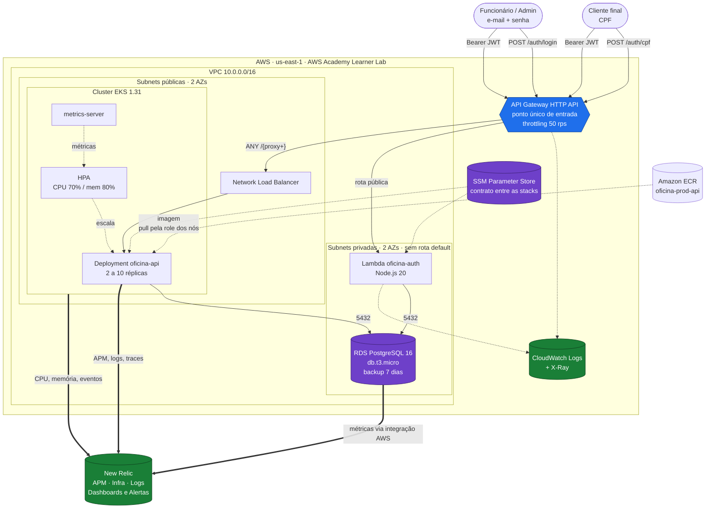
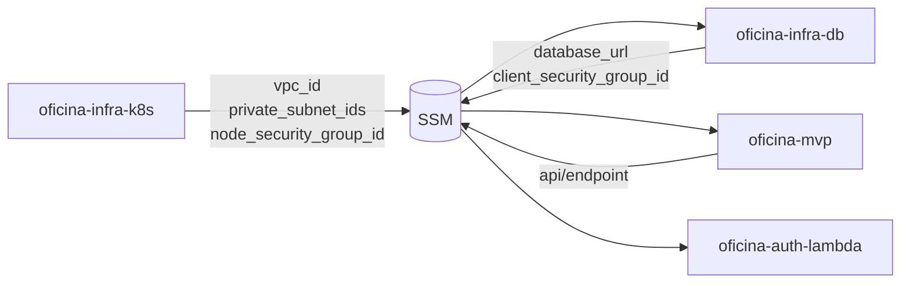
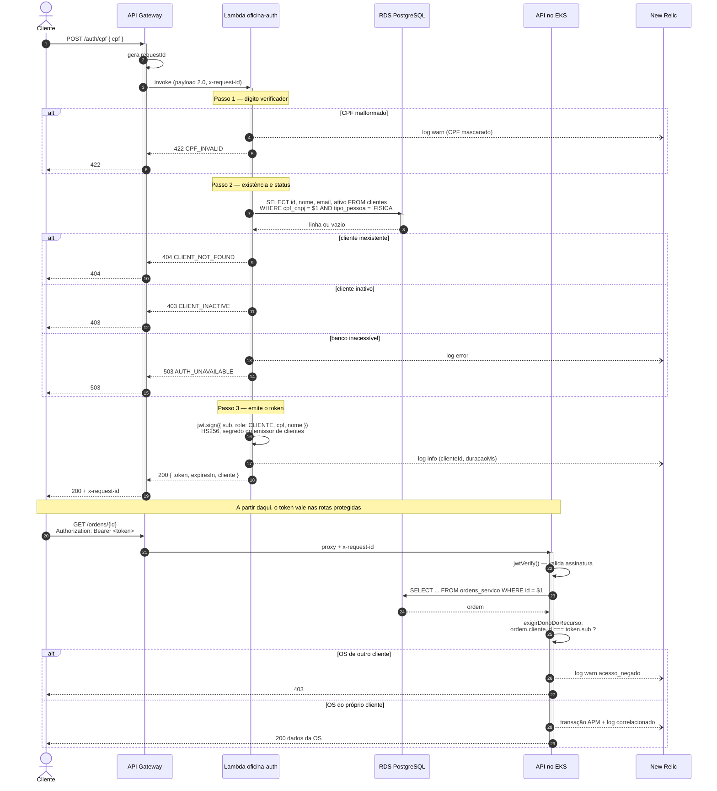
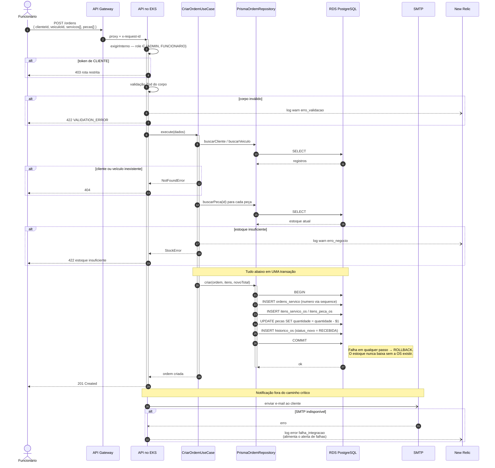
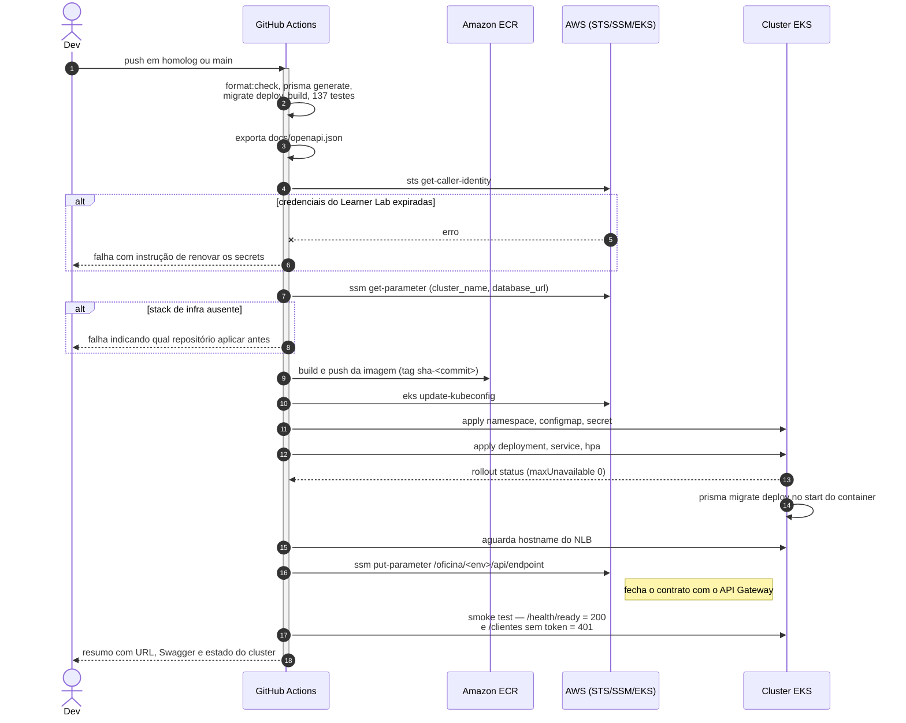

# Arquitetura de nuvem — Fase 3

Visão da plataforma depois da migração para AWS: API Gateway como entrada única,
autenticação de cliente em função serverless, aplicação em EKS, banco gerenciado e
observabilidade em New Relic.

Para a arquitetura **interna** da aplicação (Clean Architecture, camadas, casos de
uso), ver [arquitetura.md](arquitetura.md). Para o modelo de dados, ver
[modelo-de-dados.md](modelo-de-dados.md).

---

## 1. Diagrama de componentes

### Repositórios e o que cada um provisiona

| Repositório | Provisiona | Estado |
| --- | --- | --- |
| `oficina-infra-k8s` | VPC, subnets, IGW, EKS, node group, metrics-server | `infra-k8s/<env>/terraform.tfstate` |
| `oficina-infra-db` | RDS, subnet group, parameter group, security groups | `infra-db/<env>/terraform.tfstate` |
| `oficina-auth-lambda` | Lambda, API Gateway, rotas, integrações, log groups | `auth-lambda/<env>/terraform.tfstate` |
| `oficina-mvp` | Manifestos Kubernetes aplicados no cluster | — |

O acoplamento entre eles é apenas o SSM Parameter Store, sob `/oficina/<env>/`.
Nenhuma stack lê o state da outra.

Daí a ordem obrigatória de deploy:
`infra-k8s` → `infra-db` → `oficina-mvp` → `auth-lambda`.

---

## 2. Diagrama de sequência — autenticação por CPF

O ponto crítico é o passo final. Validar a assinatura do token **não basta**: sem
`exigirDonoDoRecurso`, um JWT de cliente legítimo daria acesso a qualquer OS.
Ver [ADR-0008](adr/0008-autorizacao-do-papel-cliente.md).

---

## 3. Diagrama de sequência — abertura de ordem de serviço

O e-mail é disparado **sem `await`** de propósito: a criação da OS não deve falhar
porque o servidor de e-mail está fora ([ADR-0002](adr/0002-comunicacao-sincrona-rest.md)).
Mas a falha é registrada — antes da Fase 3 ela era engolida por um
`.catch(() => {})`, e por isso nenhum alerta de "falha no processamento de ordens de
serviço" seria possível: o sinal nunca era emitido.

---

## 4. Fluxo de deploy

---

## 5. Observabilidade

| Requisito da Fase 3 | Como é atendido |
| --- | --- |
| Latência das APIs | New Relic APM (agente Node) + métricas do API Gateway |
| CPU e memória do Kubernetes | New Relic Infrastructure (`nri-bundle`) + metrics-server |
| Healthchecks e uptime | `/health` (liveness) e `/health/ready` (readiness, com `SELECT 1`) + synthetic check do New Relic |
| Alertas de falha no processamento de OS | condição NRQL sobre `evento = 'falha_integracao'` e sobre `erro_interno` |
| Logs estruturados JSON | pino na API, JSON manual na Lambda, access log JSON no gateway |
| Correlação entre requisições | `x-request-id` propagado gateway → Lambda → API, presente em toda linha e devolvido em toda resposta |
| Volume diário de OS | dashboard NRQL sobre `historico_os` / transações |
| Tempo médio por status | dashboard NRQL, calculado de `historico_os.criado_em` |
| Erros e falhas nas integrações | dashboard NRQL sobre `evento = 'falha_integracao'` |

Consultas e alertas versionados em
[`observabilidade/`](../observabilidade/) — ver o README daquele diretório para
importar no New Relic.

---

## 6. Decisões registradas

| Documento | Assunto |
| --- | --- |
| [ADR-0005](https://github.com/Xikin/oficina-infra-k8s/blob/main/docs/adr/0005-restricoes-aws-academy.md) | Restrições do AWS Academy (LabRole, credenciais de 4h, sem NAT) |
| [ADR-0006](https://github.com/Xikin/oficina-auth-lambda/blob/main/docs/adr/0006-segredos-da-lambda.md) | Segredos injetados no deploy em vez de lidos em runtime |
| [ADR-0007](https://github.com/Xikin/oficina-infra-k8s/blob/main/docs/adr/0007-eks-em-vez-de-k3s.md) | EKS gerenciado em vez de k3s de nó único |
| [ADR-0008](adr/0008-autorizacao-do-papel-cliente.md) | Autorização do papel CLIENTE |
| [ADR-0009](adr/0009-api-gateway-entrada-unica.md) | API Gateway como ponto único de entrada |
| [ADR-0010](adr/0010-observabilidade-new-relic.md) | New Relic como stack de observabilidade |
| [ADR-0011](adr/0011-segredos-jwt-por-emissor.md) | Um segredo JWT por emissor, com papel amarrado ao emissor |
| [RFC-0001](rfc/0001-escolha-do-provedor-de-nuvem.md) | Escolha do provedor de nuvem |
| [RFC-0002](rfc/0002-escolha-do-banco-de-dados-gerenciado.md) | Escolha do banco gerenciado |
| [RFC-0003](rfc/0003-estrategia-de-autenticacao.md) | Estratégia de autenticação por CPF |
