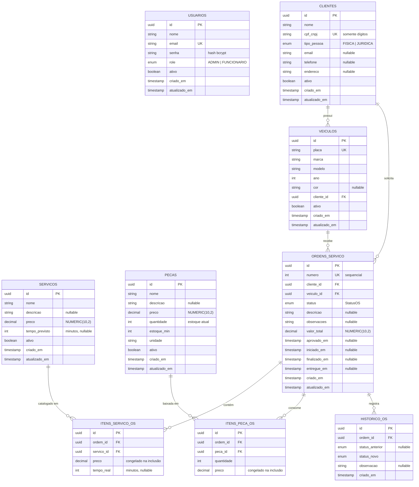

# Modelo de dados

Justificativa formal da escolha do banco, diagrama entidade-relacionamento,
explicação dos relacionamentos e os ajustes feitos no modelo relacional na Fase 3.

---

## 1. Por que um banco relacional

O domínio da oficina tem duas características que decidem a questão antes de
qualquer comparação entre produtos:

**As entidades são fortemente relacionadas.** São nove tabelas ligadas por chaves
estrangeiras obrigatórias. Uma ordem de serviço não existe sem cliente e veículo;
um item não existe sem a ordem. Num banco de documentos, ou se duplica cliente e
veículo dentro de cada OS — e a atualização de um telefone vira varredura — ou se
recriam junções na aplicação, que é o mesmo trabalho do banco relacional feito com
menos garantias.

**Há uma operação multi-tabela que precisa ser atômica.** Adicionar peças a uma OS
grava `itens_peca_os`, decrementa `pecas.quantidade` e recalcula
`ordens_servico.valor_total`. Se a baixa de estoque acontecer e a gravação do item
falhar, o estoque fica errado sem nenhum registro que explique. Isso exige
transação ACID de verdade, e não consistência eventual.

## 2. Por que PostgreSQL

Comparação aplicada ao domínio, não genérica:

| Critério | PostgreSQL | MySQL | SQL Server |
| --- | --- | --- | --- |
| Tipo numérico exato para dinheiro | `NUMERIC(10,2)`, aritmética exata | `DECIMAL` equivalente | `DECIMAL`/`MONEY` |
| Enum nativo | `CREATE TYPE ... AS ENUM` — `StatusOS` vira restrição do banco | `ENUM` de coluna, menos reutilizável | sem enum; exige tabela + CHECK |
| Sequência sem lacuna sob concorrência | `SERIAL`/`IDENTITY` com garantia | equivalente | equivalente |
| Nível de isolamento padrão | Read Committed com MVCC, sem lock de leitura | Repeatable Read | Read Committed com lock |
| Ecossistema com Prisma | suporte de primeira classe | bom | suporte mais limitado |
| Custo gerenciado na AWS | RDS free tier `db.t3.micro` | idem | licença encarece |
| Licença | PostgreSQL (permissiva) | GPL/comercial | proprietária |

Três pontos pesaram mais:

1. **`Decimal @db.Decimal(10,2)` em `preco` e `valor_total`.** Ponto flutuante
   erraria centavos ao somar itens de uma OS, e o erro se acumula por item.
2. **Enum nativo para `StatusOS`.** A máquina de estados da OS (Recebida →
   Diagnóstico → Aguardando Aprovação → Execução → Finalizada → Entregue) fica
   garantida pelo banco, não só pela aplicação. Um `UPDATE` manual errado é
   rejeitado.
3. **`numero Int @unique @default(autoincrement())`.** A numeração sequencial da OS
   não duplica mesmo com várias ordens abertas ao mesmo tempo — a sequência do
   Postgres resolve, sem lock na aplicação.

A decisão de **onde** rodar esse Postgres (RDS gerenciado em vez de `Deployment` no
cluster) está na [RFC-0002](rfc/0002-escolha-do-banco-de-dados-gerenciado.md).

---

## 3. Diagrama entidade-relacionamento

`USUARIOS` aparece isolada de propósito: não há chave estrangeira ligando usuário a
ordem de serviço. Quem executou cada transição é registrado em `historico_os` por
texto livre, não por FK — uma limitação conhecida, discutida na seção 6.

---

## 4. Relacionamentos, um a um

| Relacionamento | Cardinalidade | Obrigatório? | Ao apagar o pai |
| --- | --- | --- | --- |
| `clientes` → `veiculos` | 1:N | `cliente_id` NOT NULL | RESTRICT |
| `clientes` → `ordens_servico` | 1:N | `cliente_id` NOT NULL | RESTRICT |
| `veiculos` → `ordens_servico` | 1:N | `veiculo_id` NOT NULL | RESTRICT |
| `ordens_servico` → `itens_servico_os` | 1:N | `ordem_id` NOT NULL | **CASCADE** |
| `ordens_servico` → `itens_peca_os` | 1:N | `ordem_id` NOT NULL | **CASCADE** |
| `ordens_servico` → `historico_os` | 1:N | `ordem_id` NOT NULL | **CASCADE** |
| `servicos` → `itens_servico_os` | 1:N | `servico_id` NOT NULL | RESTRICT |
| `pecas` → `itens_peca_os` | 1:N | `peca_id` NOT NULL | RESTRICT |

**Por que a política de exclusão é assimétrica.** Não é inconsistência, é a
distinção entre agregação e composição:

- **CASCADE** nos três filhos da ordem de serviço porque item e histórico são
  *composição*: não têm significado fora da OS. Apagada a ordem, apagar os itens é
  a única leitura correta.
- **RESTRICT** em cliente, veículo, serviço e peça porque são *agregação*: existem
  por si. Apagar um serviço do catálogo não pode reescrever o histórico de uma OS
  que o cobrou. Na prática o sistema nunca apaga essas linhas — usa
  `ativo = false` (soft delete), e é por isso que `ativo` ganhou índice.

**Por que `preco` é copiado nos itens.** `itens_servico_os.preco` e
`itens_peca_os.preco` duplicam o preço do catálogo no momento da inclusão. Parece
desnormalização, e é — deliberada. Sem ela, reajustar a tabela de preços mudaria
retroativamente o valor de ordens já fechadas. O valor cobrado é um fato histórico,
não uma referência viva.

**Por que `historico_os` existe.** As colunas `aprovado_em`, `iniciado_em`,
`finalizado_em` e `entregue_em` na própria OS são um cache de leitura rápida. A
trilha completa e imutável de transições fica em `historico_os` — e é dela, não das
colunas de cache, que os painéis de tempo médio por status devem ser calculados
(ver seção 6).

**Identificadores.** As PKs são UUID em vez de inteiro sequencial: como os ids
aparecem em URL (`GET /ordens/:id`), inteiros sequenciais permitiriam enumerar
registros alheios. A OS tem, *além* do UUID, o `numero` sequencial — que é o que o
cliente lê no balcão ("sua OS é a 1042") e o que a consulta pública usa.

---

## 5. Ajustes no modelo relacional na Fase 3

### 5.1 Índices

O schema da Fase 2 **não tinha um único índice** além das chaves primárias e dos
`UNIQUE` implícitos (`usuarios.email`, `clientes.cpf_cnpj`, `veiculos.placa`,
`ordens_servico.numero`). Toda chave estrangeira e a coluna `status` provocavam
*sequential scan*.

Migration [`20260909120000_indices_fase3`](../prisma/migrations/20260909120000_indices_fase3/migration.sql):

| Índice | Consulta que ele atende |
| --- | --- |
| `veiculos(cliente_id)` | "veículos deste cliente" na tela de abertura de OS |
| `ordens_servico(cliente_id)` | histórico do cliente; guard de autorização do papel CLIENTE |
| `ordens_servico(veiculo_id)` | histórico do veículo |
| `ordens_servico(status)` | filtro da listagem e **painel de volume por status** |
| `ordens_servico(status, criado_em)` | "OS abertas, mais recentes primeiro" e o painel de volume diário |
| `historico_os(ordem_id, criado_em)` | linha do tempo de uma OS; **cálculo de tempo médio por status** |
| `historico_os(status_novo, criado_em)` | agregação de transições por período |
| `itens_servico_os(ordem_id)`, `itens_peca_os(ordem_id)` | montagem da OS completa (o `include` do Prisma) |
| `itens_servico_os(servico_id)`, `itens_peca_os(peca_id)` | "onde este serviço/peça foi usado"; validação do RESTRICT |
| `clientes(nome)` | busca por nome no atendimento |
| `clientes(ativo)`, `servicos(ativo)`, `pecas(ativo)` | listagens padrão, que filtram por ativo |

Todos são aditivos: nenhum altera dados nem restringe o que já era aceito.

### 5.2 Papel CLIENTE fora do enum do banco

A autenticação por CPF introduz o papel `CLIENTE`, mas o enum `Role` do banco
**continua com `ADMIN` e `FUNCIONARIO`**. A razão é modelagem, não preguiça: um
cliente não é linha em `usuarios` — não tem senha, não tem e-mail obrigatório, e
seu cadastro vive em `clientes`. Acrescentar `CLIENTE` ao enum permitiria criar um
`Usuario` com esse papel, um estado que nada no sistema saberia interpretar.

O papel existe apenas no claim `role` do JWT. Ver
[`src/domain/enums/role.enum.ts`](../src/domain/enums/role.enum.ts).

---

## 6. Limitações conhecidas e próximos ajustes

Itens identificados mas **não** implementados, porque exigem decisão de negócio ou
migração de dados — registrados aqui para não se perderem:

**`itens_servico_os` aceita o mesmo serviço repetido.** Não há `UNIQUE
(ordem_id, servico_id)`, e `AdicionarItensUseCase` soma o preço a cada inclusão.
Isso pode ser correto (duas horas da mesma mão de obra) ou um bug de digitação
duplicada. Se a regra for "um serviço por OS, com quantidade", o ajuste é adicionar
coluna `quantidade` e a constraint — o que **quebraria** ordens existentes com
repetição. Precisa de decisão da oficina.

**As colunas de timestamp da OS são um cache que pode divergir.** `aprovado_em`,
`iniciado_em`, `finalizado_em` e `entregue_em` são gravadas pela aplicação; se uma
transição for feita por SQL direto, elas ficam desatualizadas enquanto
`historico_os` continua correto. Por isso **os painéis devem ser calculados a
partir de `historico_os.criado_em`**, que é `DEFAULT now()` gerado pelo banco.

> Nota: até a Fase 3 essas quatro colunas estavam sistematicamente erradas — a
> constante `TIMESTAMP_CAMPO` avaliava `new Date()` uma única vez, no carregamento
> do módulo, de modo que toda ordem recebia o horário de boot do processo. O bug
> foi corrigido, mas dados gravados antes da correção permanecem inválidos.

**Não há FK de autoria nas transições.** `historico_os` não guarda qual usuário
executou a mudança. Adicionar `usuario_id FK` daria trilha de auditoria completa;
exige decidir o que fazer com as transições feitas pelo próprio cliente, que não
são `usuarios`.

**`clientes.cpf_cnpj` é uma coluna para dois documentos.** CPF (11) e CNPJ (14)
compartilham a coluna, com o tipo distinguido por `tipo_pessoa`. Funciona e tem
`UNIQUE`, mas impede uma constraint de tamanho por tipo. A consulta da Lambda de
autenticação filtra `tipo_pessoa = 'FISICA'` justamente por isso.
