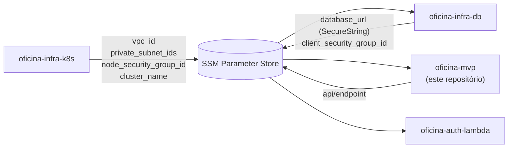

# Terraform

> **Este documento mudou de escopo na Fase 3.**
>
> Na Fase 2, o diretório `infra/` deste repositório provisionava um cluster
> **Kind local** (provider `tehcyx/kind`), com PostgreSQL rodando como
> `Deployment` dentro do cluster.
>
> Na Fase 3 a infraestrutura foi para a nuvem e, conforme o enunciado exige,
> **separada em repositórios próprios**. O diretório `infra/` foi removido deste
> repositório — a aplicação não provisiona mais infraestrutura, apenas consome.

---

## Onde está o Terraform agora

| Repositório | Provisiona | Estado remoto |
| --- | --- | --- |
| [`oficina-infra-k8s`](https://github.com/Xikin/oficina-infra-k8s) | VPC, subnets, IGW, cluster EKS, managed node group, metrics-server | `s3://<bucket>/infra-k8s/<env>/terraform.tfstate` |
| [`oficina-infra-db`](https://github.com/Xikin/oficina-infra-db) | RDS PostgreSQL, subnet group, parameter group, security groups | `s3://<bucket>/infra-db/<env>/terraform.tfstate` |
| [`oficina-auth-lambda`](https://github.com/Xikin/oficina-auth-lambda) | Lambda de autenticação, API Gateway, rotas, log groups | `s3://<bucket>/auth-lambda/<env>/terraform.tfstate` |

Cada um tem pipeline própria: `plan` comentado no PR, `apply` no merge para
`homolog` e `main`.

## O que mudou, ponto a ponto

| | Fase 2 (`infra/` neste repo) | Fase 3 (repositórios próprios) |
| --- | --- | --- |
| Cluster | Kind local, 1 control-plane + 1 worker | Amazon EKS 1.31, node group de 2 a 4 nós |
| Banco | `Deployment` de Postgres + PVC no cluster | Amazon RDS PostgreSQL, subnet privada |
| Exposição | `NodePort` 30000 + `extra_port_mappings` | Network Load Balancer atrás do API Gateway |
| State | arquivo local, `terraform.tfstate` no disco | S3 com versionamento, criptografia e lock nativo |
| Autoscaling | HPA sem metrics-server — nunca escalava | HPA + metrics-server + autoscaling de nós |
| Segredos | `terraform.tfvars` local | SSM Parameter Store (SecureString) |
| Aplicação | `terraform apply` manual | GitHub Actions no merge |

## Contrato entre as stacks

As três stacks não leem o state uma da outra. O acoplamento é o **SSM Parameter
Store**, sob `/oficina/<env>/`:



Daí a ordem obrigatória de deploy:

```
oficina-infra-k8s  →  oficina-infra-db  →  oficina-mvp  →  oficina-auth-lambda
```

Cada pipeline verifica no início se os parâmetros de que depende já existem, e
falha com mensagem dizendo qual repositório aplicar antes.

## Bootstrap do backend

O bucket de state é criado uma única vez, por um script que vive em
`oficina-infra-k8s`:

```bash
cd ../oficina-infra-k8s
./bootstrap/backend.sh
```

## Ambiente local

Para desenvolvimento local não é mais preciso Terraform nem Kind — o
`docker-compose.yml` deste repositório sobe API e PostgreSQL:

```bash
docker compose up -d --build
```

Ver [desenvolvimento.md](desenvolvimento.md).

## Decisões relacionadas

- [ADR-0005](https://github.com/Xikin/oficina-infra-k8s/blob/main/docs/adr/0005-restricoes-aws-academy.md) —
  restrições do AWS Academy: `LabRole`, credenciais de 4h, ausência de NAT Gateway
- [ADR-0007](https://github.com/Xikin/oficina-infra-k8s/blob/main/docs/adr/0007-eks-em-vez-de-k3s.md) —
  por que EKS gerenciado em vez do k3s de nó único que a RFC-0001 recomendava
- [RFC-0001](rfc/0001-escolha-do-provedor-de-nuvem.md) — escolha da AWS
- [RFC-0002](rfc/0002-escolha-do-banco-de-dados-gerenciado.md) — escolha do RDS
